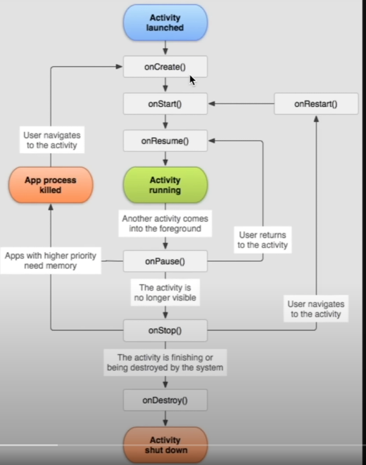

### Android Concept

#### Activity
Activity as a unit of app where user interact

click, activate something -> all are activity

#### fragments
bundled multiple screen in 1 activity
For jetpack compose, will only have 1 activity

#### Activity life cycle

- OnCreate
- OnStart (just started and become visible)
- onResume(user can interact with it)
- When anything come to foreground(eg activity, dialog,etc) -> go to onPause()
- when user return to activity, it will go back to resume state
- When no longer visible eg navigate to other page -> onStop()
- somehow on the background -> onPause, already not visble anymore -> onStop
- eg browser at background -> onPause, broswer icon -> onResume, closed browser -> onStop
- if user come back to the actibity at onStop state -> onRestart()
- if actibity is finished -> onDestroy()
- onDestroy also triggered when configuration changes eg screen rotation OR app crashed


#### Back Stack
when user click a book mark screen, it immediately push on the back stack (Stack)
Browser Screen -> Bookmark screen , when click previous it will pop
Task is the collection of multiple screen activity together (eg Browser Screen->Bookmark Screen )
when click on the instagram link, it will go to another task with a stack
##### Launch Mode (set the behaviour when new actibity push on the back stack)
- Standard , open then push a activity on the back stack, click the same link have the same activity instance but push on the back stack
- Single Top, if there is already an existing instance (activity) we want to launch, we wont't add another
but just send user to the already created one
- Single Task, new instances will always be launched to a completely separate task
eg reviewing ig story, click on link which you want to open with your browser app, as soon as it go back, it should
go back to instagram and not the bookmark activity (the first task's back stack)

- Single Instance, also launch new task but new activity opened is completely isolated and not allowed to open any new activity in the task
eg payment activity, invoked only from other apps who use payment with paypal, so user cant go to other activity

#### View Model
we want to bring consistency for stability, we use architectural design pattern eg (MVC, MVP, MVI)
android use mvvm (model, view, view model)
View (app ui)
View Model (bridge between view and model)
Model (app data live)
View UI Action -> View Model update Model -> Model notify View Model ->  View Model notify View
if eg change color , View Model can do it for View
as for saving some data, it will pass to Model to do
View Model is just a Model for a View, that can be just a single UI Component eg list item
one View Model per screen is common

##### Configuration changes
eg dark mode to white mode, screen rotation
it will go to destroy state , and restart the activity
solution: ContactsViewModel : ViewModel() (extends the viewmodel)
so it will create a view model which outlive the life cycle of its screen
only destroyed the view model when the user completely pop the activity from the Back Stack eg click back button
Its still not work even extend ViewModel, because we instantiate the object by kotlin way
Two way to do it
```
use "by"
private val viewModel by viewModels<ContactsViewModel>()
```

OR
```
implementation("androidx.lifecycle:lifecycle-viewmodel-compose:2.8.3")

then inside the Theme
        setContent {
            KotlinAppTheme {
                val viewModel = viewModel<ContactsViewModel>()
                
```

However, when we need constrcutor on the viewmodel, we cant make it , because we define the val viewModel by a static class
So we need View Model Factory
##### View Model Factory
class that defines how View Model instance is to be created
Ctrl+P on () of viewModel
we need to use ViewModelProvider.Factory, and override the create method, originally is super.create(modelClass)
because we have constructor, so we need to return by the class we created
Also, we need to cast as parameter type T to prevent error
```
                val viewModel = viewModel<ContactsViewModel>(
                    factory = object : ViewModelProvider.Factory {
                        override fun <T : ViewModel> create(modelClass: Class<T>): T {
                            return ContactsViewModel(
                                helloWorld = "Hello World!"
                            ) as T
                        }
                    }
                )
```