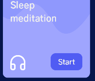
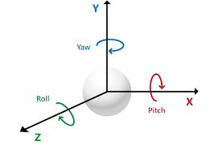
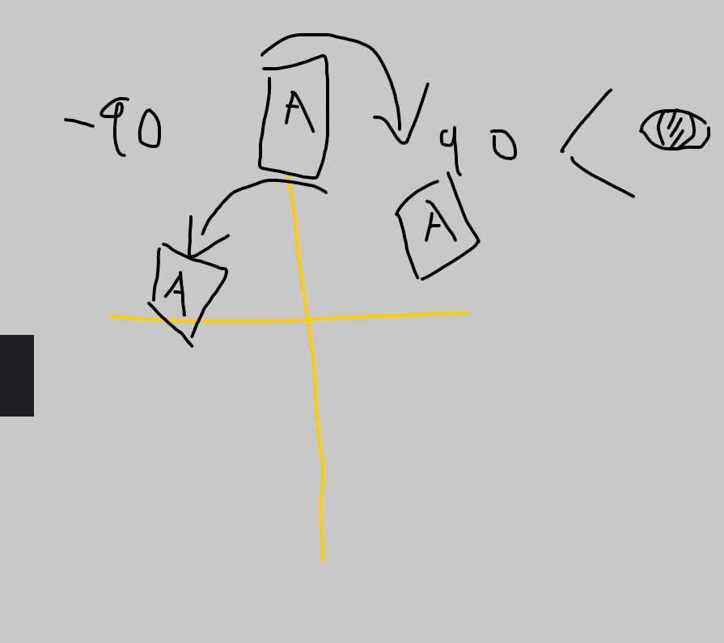

#### 
#### Composable (UI part)
turn UI to components (reusable)

#### Row Column
put text in correct position
```
Column {
    Text(text = "Hello")
    Text(text = "Goodbye")
}
```
if ROW its order horizontally, so X-axis is the Main-axis
Y-axis = Cross-axis (verticalAlignment)
X-axis = Main-axis (horizontalArrangement)

if Column , Y-axis (verticalArrangement), X-axis (horizontalAlignment)
Y-axis = Main-axis
X-axis = Cross-axis

SpaceBetween (separate them, dont have starting and ending space)
SpaceEvenly (separate them, have start and end space)
SpaceAround (similar SpaceEvenly, start and end space slightly smaller)


#### Modifier
the size distribute for this Column
fillMaxSize(0.5f) // 50% height, 50% width of total screen
OR
width(200.dp)
```
        setContent {
            Column(
                modifier = Modifier
                    .fillMaxSize()
                    .background(Color.Green),
                horizontalAlignment = Alignment.CenterHorizontally,
                verticalArrangement = Arrangement.Bottom
            ) {
                Text(text = "Hello")
                Spacer(modifier = Modifier.height(50.dp))
                Text(text = "Goodbye")
            }

        }
```
requiredWidth(it will exceed monitor screen with exactly width) vs width( it will set max width can hit)

Text(text = "Hello", modifier = Modifier.offset(50.dp, 30.dp)) // offset our text like margin but wont push away other elements
offset always start at top-left  move 50.dp from left-right, 30.dp top-bottom

Modifier.clickable{}
#### Spacer
Spacer(modifier = Modifier.height(50.dp)) // insert empty space above the Goodbye text

#### Box
col and row container that can put composable into it
Box can align with other box or overlap

#### sp(font size) dp(layout size)
sp because it scale upon user font
dp won't scale

#### Card + Box
Card contain 1 child Box
that child Box contain Image and 2 Box
which mean the Image and that 2 Box is overlapped but adjusted X,Y according to the maximum of parent Box size which is
200.dp
```
@Composable
fun ImageCard(
    painter: Painter,
    contentDescription: String,
    title: String,
    modifier: Modifier = Modifier
) {
    Card(
        modifier = modifier.fillMaxWidth(),
        shape = RoundedCornerShape(15.dp),
        elevation = CardDefaults.cardElevation(defaultElevation = 5.dp)
    ) {
        Box(modifier =Modifier.height(200.dp) ) {
            Image(
                painter = painter,
                contentDescription = contentDescription,
                contentScale = ContentScale.Crop
            )
            Box(
                modifier = Modifier
                    .fillMaxSize()
                    .background(
                        brush = Brush.verticalGradient(
                            colors = listOf(
                                Color.Transparent,
                                Color.Black
                            ),
                            startY = 300f
                    )   )
            )
            Box(
                modifier = Modifier
                    .fillMaxSize()
                    .padding(12.dp),
                contentAlignment = Alignment.BottomStart
            ) {
                Text(title, style = TextStyle(color = Color.White, fontSize = 16.sp))
            }
        }
    }
}
```

#### Annotated String
apply different style to different parts of our string  
buildAnnotatedString(
    withStyle() {
        
    }
)
```
Box(modifier = Modifier
                .fillMaxSize()
                .background(Color(0xFF101010))) {
                Text(
                    text = buildAnnotatedString {
                        withStyle(
                            style = SpanStyle(
                                color = Color.Green
                            )
                        ) {
                            append("J")
                        }
                        append("etpack ")
                        withStyle(
                            style = SpanStyle(
                                color = Color.Green
                            )
                        ) {
                            append("C")
                        }
                        append("ompose")
                    },
                    color = Color.White,
                    fontSize = 30.sp,
                    fontFamily = fontFamily,
                    fontWeight = FontWeight.Bold,
                    fontStyle = FontStyle.Italic,
                    textAlign = TextAlign.Center,
                    textDecoration = TextDecoration.Underline
                )
            }
```

#### State
describe how our given UI looks at the moment
how UI looks at specfic moment -> UI State
Counter variable of state of button
re-render -> recomposing (in jetpack compose)

If recompose, the function will execute again, thats why we need "remember" to store the current mutableStateOf()
```
    val color = remember {
        mutableStateOf(Color.Yellow)
    }
```
#### Row, Column
weight attribute, the importance of that column, so higher => more space for that element


#### Naming Convention
general the function is first letter is small
but if it is a @Composable fun , first letter is Capital

#### SnackBar
use for temporary display eg (Notification)
#### Scaffold
for toolbar , navigation
Scaffold is a composable in Jetpack Compose that provides a foundation for building an app. 
It takes a set of composables and arranges them in a consistent manner to create a consistent look and feel across all screens in your app.

#### TextField (need state that track the input text)
from material design, basic input field
BasicField, free to make your own design

#### rememberScrollState
```
            val scrollState = rememberScrollState()
            Column(
                modifier = Modifier.verticalScroll(scrollState)
            ) {
```

####  LazyColumn
LazyColumn already have scroll state

only load when we scroll
two way to achieve it (itemsIndexed, items)
itemsIndexed is simply a for-each, items is automatically generate all with defined size(500)
```
                itemsIndexed(
                    listOf("This","Is","Jetpack","Compose")
                ) {
                    index: Int, item: String ->
                    Text(
                        text = "$item $index",
                        fontSize = 24.sp,
                        fontWeight = FontWeight.Bold,
                        textAlign = TextAlign.Center,
                        modifier = Modifier
                            .fillMaxWidth()
                            .padding(vertical = 24.dp)
                    )
                }
                items(500) {
                    Text(
                        text = "Item $it",
                        fontSize = 24.sp,
                        fontWeight = FontWeight.Bold,
                        textAlign = TextAlign.Center,
                        modifier = Modifier
                            .fillMaxWidth()
                            .padding(vertical = 24.dp)
                    )
                }
```

#### ConstraintSet + ConstraintLayout
start(left), end(right), top(top) ,bottom(bottom)
    implementation(libs.androidx.constraintlayout.compose)
    implementation(libs.androidx.constraintlayout)
create reference for each composable we want to constraint
define rule (ConstraintSet)
make layout (ConstraintLayout)

```
            val constraints = ConstraintSet {
                val greenBox = createRefFor("greenbox")
                val redBox = createRefFor("redbox")

                constrain(greenBox) {
                    top.linkTo(parent.top) // top constraint of green box LINK TO parent TOP
                    start.linkTo(parent.start)
                    width = Dimension.value(100.dp)
                    height = Dimension.value(100.dp)
                }
                constrain(redBox) {
                    top.linkTo(parent.top)
                    start.linkTo(greenBox.end)
                    end.linkTo(parent.end)
                    width = Dimension.value(100.dp)
                    height = Dimension.value(100.dp)
                }
            }
            ConstraintLayout(constraints, modifier = Modifier.fillMaxSize()) {
                Box(modifier = Modifier
                    .background(Color.Green)
                    .layoutId("greenbox"))
                Box(modifier = Modifier
                    .background(Color.Red)
                    .layoutId("redbox"))

            }
```

It will place the redBox between start and parent end so its a middle, there will be empty white, so fill it
use "width = Dimension.fillToConstraints" 
``` 
start.linkTo(greenBox.end)
end.linkTo(parent.end)
width = Dimension.value(100.dp)
height = Dimension.value(100.dp)

```
make a horizontal chain, so all layout reference(greenBox,redBox) will have same group of rule set
createHorizontalChain(greenBox,redBox, chainStyle = ChainStyle.Packed)

guideline (transparent layout for ContraintLayout)   , which this guideline take (50% fraction of the screen)
val guideline = createGuidelineFromTop(0.5f)
when link to guideline, there will be a 50% transparent barrier and greenBox will start after the 50% of the screen 
```
constrain(greenBox) {
    top.linkTo(guideline) //
    start.linkTo(parent.start)
    width = Dimension.value(100.dp)
    height = Dimension.value(100.dp)
}
```


if simple Layout (row,col) , in xml/complex layout (use constraintlayout, significant performance issue)

A chain is a group of views that are linked to each other with bi-directional position constraints. For example, 
figure shows two views that both have a constraint to each other, thus creating a horizontal chain


#### Effect Handlers
Side Effect (escape the scope of composable function)
"i" is one of the side effect, we dont know when the program recompose after button clicked, so its not inside composable
use "effect handlers" instead
```
private var i = 0
...
        setContent {
            var text by remember {
                mutableStateOf("")
            }

            Button(onClick = {
                text += "#"
            }) {
                i++
                Text(text = text)
            }
        }
```
##### LaunchedEffect
for CoroutineScope, we can do suspension 

By default the LaunchedEffect will execute
When "text" change, the LaunchedEffect will cancel the execution and Relaunch it with new Value
```
LaunchedEffect(key1 = text) {
    delay(1000L)
}
```
LaunchedEffect also good on animation 
eg you are left click and right click picture, so the right click animation cancel and immediately execute left click
when you click right and click left so fast

##### rememberCoroutineScope (only use on callbacks eg onClick, onEventListener)
why only on callbacks? because you can track it (WONT BECOME Side Effect), like you click one then it can change one, which is controllable 
val scope = rememberCoroutineScope()
```
Button(onClick{
    scope.launch {
        delay(1000L)
        println("Hello World")
    }
}) {

}
```
##### rememberUpdatesState
for splash screen, we use onTimeOut() to finish the splash screen
However, onTimeout() inside LaunchedEffect may not linked to the updated onTimeout: () -> Unit function
eg you set onTimeout with 3 second, then somehow you set it as 5 second, the onTimeout() inside LaunchedEffect will have no idea about the 5 second update, so
just 3 second later, you out the splash

Solution: val updatedOnTimeout by rememberUpdatesState(newValue = onTimeout)
so the updatedOnTimeout will be updated when onTimeout changing 
```
fun demo(
onTImeOut: () -> Unit
) {
     val updatedOnTimeout by rememberUpdatesState(newValue = onTimeout)
     LaunchedEffect(key = true) {
        delay(3000L)
        updatedOnTimeout()
     }
}
```

##### DisposableEffect (for clean up)
when we want to dispose something eg Observer, when the composable leaves the composition the DiposableEffect will triggered
```
val lifeCycleOwner = LocalLifecycleOwner.current // get current life cycle
DisposableEffect(key1 = lifecycleOwner) {
   val observer = LifecycleEventObserver { _, event -> 
        if(event == Lifecycle.Event.ON_PAUSE) {
            println("on pause called")
        }
   }
   // add the observer
   lifecycleOwner.lifecycle.addObserver(observer)
   onDispose {
    lifecycleOwner.lifecycle.removeObserver(observer)  // remove the observer when leaving the composition
   }
}

```

#### LifeCycleEventObserver
to observe the current state the application is in (eg onPause, onStart, onStop)

##### Side Effect 
called whenever the composable is successfully recomposed
```
    SideEffect {
        // non-compose code (not a state eg data from API) BUT we want to treat like a state
        println("Called after every successful recomposition")
    }
```

##### produceState  (produce some states that changes overtime)
Similar to Flow
```
// it return a State<Int> 
// it use "value" as the variable
@Composable 
fun produceStateDemo(countUpTo : Int) : State<Int> {
    return produceState(initialValue = 0) {
        while(value < countUpTo) {
            delay(1000L)
            value++
        }
    }
}
```


##### Flow

```
@Composable 
fun produceStateDemo(countUpTo : Int) : State<Int> {
    return flow<Int> {
        var value = 0
        while(value < countUpTo) {
            delay(1000L)
            value++
            emit(value) // insert a new value to the shared flow
        }
    }.collectAsState(initial = 0)
}
```

##### derivedStateOf
use it when you want to do something depend on State (eg calculation, concat)
```
fun DerivedStateOfExample() {
    var counter by remember {
        mutableStateOf(0)
    }
    // val counterText  = "Counter is $counter" // this line keep recompute when Text called
    val counterText by derivedStateOf {
     "Counter is $counter" // will cache it, and whenever changes happen, it will notify all composables that counterText updated, else use the cahed one only
    }
    Button(onClick = {counter++}) {
        Text(text = counterText)
    }
}
```

##### snapshotFlow
collectAsState (if you have a flow, then use this to get the flow in form of (以...的形式) a compose state)
snapshotFlow (opposite, take compose state to construct the flow out of that emits value whenever the composed state changes)

#### Flow
Flow is a part of the Kotlin Coroutines library and is used for handling asynchronous streams of data in a reactive and non-blocking manner.
It provides a convenient way to handle sequences of values that are emitted over time.


#### Animation
animateDpAsState give a dp State which have animation included
rememberInfiniteTransition() (animateColor function to have infinite color changing)
```
            var sizeState by remember {
                mutableStateOf(200.dp)
            }
            val size by animateDpAsState(
                targetValue = sizeState,
//                tween(
//                    durationMillis = 3000, // duration
//                    delayMillis = 300, // little delay after click
//                    easing = LinearOutSlowInEasing
//                )
                keyframes {
                    durationMillis = 5000
                    sizeState at 0 using LinearEasing // begin state
                    sizeState * 1.5f at 1000 using FastOutLinearInEasing // at 1000 milisecond, set value as *1.5
                    sizeState * 2f at 5000 // then slowly increase to *2
                }

            )
            
            val infiniteTransition = rememberInfiniteTransition()
            val color by infiniteTransition.animateColor(
                initialValue = Color.Red,
                targetValue = Color.Green,
                animationSpec = infiniteRepeatable(
                    tween(
                        durationMillis = 2000
                    ),
                    repeatMode = RepeatMode.Reverse
                ), label = ""
            )
            Box(modifier = Modifier
                .size(size)
                .background(color),
                contentAlignment = Alignment.Center) 
            {
                    Button(onClick = {
                        sizeState += 50.dp
                    }) {
                        Text("Increase Size")
                    }

            }
```
##### Animation
use animateFloatAsState to play Animation, LaunchedEffect to only trigger the animation once
Canvas to draw the shape, Text to display
``` 
@Composable
fun CircularProgressBar(
    percentage: Float,
    number: Int,
    fontSize : TextUnit = 28.sp,
    radius: Dp = 50.dp,
    color: Color = Color.Green,
    strokeWidth: Dp = 8.dp,
    animateDuration: Int = 1000,
    animateDelay: Int = 0
) {
    var animationPlayed by remember {
        mutableStateOf(false)
    }
    val currentPercentage = animateFloatAsState(
        targetValue = if(animationPlayed) percentage else 0f, label = "",
        animationSpec = tween(
            durationMillis = animateDuration,
            delayMillis = animateDelay
        )
    )
    LaunchedEffect(key1 = true) {
        animationPlayed = true
    }

    Box(
        contentAlignment = Alignment.Center,
        modifier = Modifier
            .size(radius * 2f)
    ){
        Canvas(
            modifier = Modifier
                .size(radius * 2f)
        ) {
            // the green arc line
            drawArc(
                color = color,
                -90f,
                360 * currentPercentage.value, // SweepAngle where is the line draw stopped
                useCenter = false, // no center line
                style = Stroke(strokeWidth.toPx(), cap = StrokeCap.Round)
            )
        }
        Text(text = (currentPercentage.value * number).toInt().toString(),
            color = Color.Black,
            fontSize = fontSize,
            fontWeight = FontWeight.Bold)
    }
}

```

##### aspect ratio (modifier)
different phone have different height/width, whatever the width is , we will set same value for height 
so if 1 -> it is a square

##### BowWithConstraints (predefined Composable)
provided by Jetpack Compose
rather than us provide the width,height
Jetpack can make view for us and return h,w
constraints.maxWidth
So that if we already defined a parent (its size and padding,etc)
we can make our child and without guessing its size or using dp
by Using the maximum height/width

##### Offset(x,y)
we just make a 2D offset, so that it can for other purpose eg (draw a Path)
```
Path drawing, the mediumColoredPoint5 can draw a very steep curve, because it even draw outside the boundary
and we ignored the draw exceed the boundary, so that get a very steep curve
        val mediumColoredPoint1 = Offset(0f, height * 0.3f)
        val mediumColoredPoint2 = Offset(width * 0.1f, height * 0.35f)
        val mediumColoredPoint3 = Offset(width * 0.4f, height * 0.05f)
        val mediumColoredPoint4 = Offset(width * 0.75f, height * 0.7f)
        val mediumColoredPoint5 = Offset(width * 1.4f, -height.toFloat())
        
        // draw a path (all below is Unit function) 
        // Path() (create new instance)
        // .apply (apply series of Path function on that instance)
        val mediumColoredPath = Path().apply {
            moveTo(mediumColoredPoint1.x, mediumColoredPoint1.y) // initial starting draw point
            // we make an extension function "Path.standardQuadFromTo" and make use of "quadraticBezierTo (Path func)"
            standardQuadFromTo(mediumColoredPoint1, mediumColoredPoint2)  
            standardQuadFromTo(mediumColoredPoint2, mediumColoredPoint3)
            standardQuadFromTo(mediumColoredPoint3, mediumColoredPoint4)
            standardQuadFromTo(mediumColoredPoint4, mediumColoredPoint5)
            lineTo(width.toFloat() + 100f, height.toFloat() + 100f)
            lineTo(-100f, height.toFloat() + 100f)
            close()
        }
        
        // Draw path
        Canvas(
            modifier = Modifier
                .fillMaxSize()
        ) {
            drawPath(
                path = mediumColoredPath,
                color = feature.mediumColor // fill the color inside the path
            )
        }
```
The light color is the result 
  
Next time if we want a new color, just simply override below and draw a path again 
(Without Row, Column, same level elements can overlap each other)


##### Wrapper Data Class
Data class is ususally for Wrapper as we know in Kotlin Basic
by @DrawableRes, the return Int,Field or Method is a resource REFERENCE
```
data class BottomMenuContent(
    val title: String,
    @DrawableRes val iconId: Int  // we tell Jetpack this iconId is a drawable id (Then we can pass it to the Wrapper)
)
```

##### by remember
State, whenever updated will trigger the related function
```
    var selectedItemIndex by remember {
        mutableStateOf(initialSelectedItemIndex)
    }
```
#### Modifier
if parent modifier is passed, all attribute will be used ,
eg modifier will have size(200.dp), so child if using "modifier" not "Modifier" also have 200.dp size 
``` 
modifier = Modifier
.size(200.dp)
```

#### LaunchedEffect 
infinite update by flag
```
    LaunchedEffect(key1 = currentTime, key2 = isTimerRunning) {
        // if currentTime changes or isTimerRunning changes
        // we run the code block, so here if true then execute the below
        if(currentTime >= 0L && isTimerRunning) {
            delay(100L)
            currentTime -= 100L // here we change, so will trigger again
            value = currentTime / totalTime.toFloat()
        }
    }
```

#### animateAsXXX
we make the targetValue, for example 1f and 0f
animationSpec will make the value 1f to 0f smoothly
```
    val alpha = animateFloatAsState(
        targetValue = if(isOpen) 1f else 0f,
        animationSpec = tween(
            durationMillis = 300
        )
    )
```
#### scale(x,y) Modifier
scale(1f, -1f) // eg (X = 360. Y = 150) -> (360,-150) // vertical flip

#### graphicsLayer{}  modifier
attirbute:
transformOrigin = TransformOrigin(0.5f, 0f) // move pivot to 50% X, 0% Y
rotationX = rotateX.value  // change the rotation  , eg (0 to -90)

assume a plane, and flip on X-axis 
0 to -90, flip down  , 
-90 to 0, flip above
##### Flip perspective

in Eye, when flip -90, it cant see A
when flip 90, still can see A

#### .alpha() Modifier
if value<1 , no draw
if value > 1, draw

#### Nav host
NavHost(navController, )
navController, Navhost need to listen to changes and commands from that navController
startDestination, 
Jetpack Compose dont usually use graph, but specify routes (strings like url)
composable() ,tell navHost how the screen look like

#### contentAlignment vs Modifier.align

#### OvershootInterpolator 超過原本size
In animation, an interpolator determines how the animated values are interpolated or transitioned over time. 

The OvershootInterpolator is a type of interpolator that adds an overshoot effect to the animation.
The overshoot effect occurs when the animated value surpasses the target value momentarily before returning to it.
This creates a visual effect of the animation "overshooting" its final position and then bouncing back.
eg 0 to 5f -> 5f to 2f(targetValue)
fraction of animation play ("it" in easing attribute of scale.animateTo)
eg if you at 250millisecond at the animation(500 millis total), the fraction will be 50%(0.5)
As for the tension in "OvershootInterpolator(2f)" , which in this case (2f)


#### SplashScreen
the Animation will go to targetValue(0.3f) , (0 to 0.3)
the image will change by scale 0 to 0.3
as for the animation, its easing 

```
@Composable
fun SplashScreen(navController: NavController) {
    val scale = remember {
        Animatable(0f)
    }
    LaunchedEffect(key1 = Unit) {
        scale.animateTo(
            targetValue = 4f,
            animationSpec = tween(
                durationMillis = 1000,
                easing = {
                    OvershootInterpolator(2f).getInterpolation(it)
                }
            )
        )
        delay(1000L)
        navController.navigate(Screen.MainScreen.route)
    }

    Box(modifier = Modifier.fillMaxSize(), contentAlignment = Alignment.Center) {
        Image(painter = painterResource(id = R.drawable.ic_launcher_foreground) , contentDescription = "foreground", modifier = Modifier.scale(scale.value))
    }
} 
```

#### Hilt (DI library) (similar as MVC in spring) 
Hilt will manage (Application, Module, Class which use the DI)
We dont care about the Repository.class, because the creation of this class is from Module.kt

Application Child + Module
ViewModel (the model that use the Instance by Depencies Injection)

WorkApplication must extend Application(), because the android app start, Application.class will execute first
so the child of Application.class which is WorkApplication will start too. Annotation of @@HiltAndroidApp is needed

Module is the place for the definition of getInstance alike function 
as we need IWorkerRepository in WorkerViewModel, we make getRepository() function and @Provides keyword automatically inject into WorkerViewModel
```
//WorkerModule.kt
@Module
@InstallIn(SingletonComponent::class) // the hierarchy
object WorkerModule {
    @Singleton // the return type (always same reference)
    @Provides
    fun getRepository(): IWorkerRepository {
        return WorkerRepostiory
    }
}
```

WorkerViewModel use Instance of IWorkerRepository, after @HiltViewModel and @Inject constructor 
Hilt will inject the instance for WorkerViewModel, without the need of creating instance by ourself
```
//WorkerViewModel.kt
@HiltViewModel
class WorkerViewModel @Inject constructor(private val workerRepostitory: IWorkerRepository): viewModel() {
    fun compressImage(uri: Uri, context:Context) {
        workerRepostitory.compressImage(uri,context)
    }
}
```
Now the WorkerViewModel no longer by = WorkerViewModel but 
```
    val workerViewModel: WorkerViewModel = hiltViewModel() // so that this Model managed by Hilt too and instantiate repo object
```

@AndroidEntryPoint

#### Room (Database) (Library)

#### Kotlin-parcelize

#### suspend function

#### ellipsize
            android:ellipsize="end"

#### ViewBinding (buildFeatures)
import com.peter.simplenotesapp.databinding.ItemNoteBinding // because the xml is item_note.xml

```
class NoteAdapter(private val mNotes: List<Note>, private val listener: OnNoteClickListener): RecyclerView.Adapter<NoteAdapter.ViewHolder>() {

    interface OnNoteClickListener {
        fun onNoteClick(note: Note)
        fun onNoteLongClick(note: Note)
    }

    inner class ViewHolder(private val binding: ItemNoteBinding): RecyclerView.ViewHolder(binding.root) {
        init {
            binding.apply {
                root.setOnClickListener {
                    val position = adapterPosition
                    if(position != RecyclerView.NO_POSITION) {
                        val note = mNotes[position]
                        listener.onNoteClick(note)
                    }
                }

                root.setOnLongClickListener {
                    val position = adapterPosition
                    if(position != RecyclerView.NO_POSITION) {
                        val note = mNotes[position]
                        listener.onNoteClick(note)
                    }
                    true
                }
            }
        }

        fun bind(note: Note) {
            // bind data to UI
            binding.apply {
                titleNote.text = note.title
                contentNote.text = note.content
                val formatter = SimpleDateFormat("dd/MM/yyyy")
                dateNote.text = formatter.format(note.date)
            }
        }
    }

    override fun onCreateViewHolder(parent: ViewGroup, viewType: Int): ViewHolder {
        val binding = ItemNoteBinding.inflate(LayoutInflater.from(parent.context), parent, false)
        return ViewHolder(binding)
    }

    override fun getItemCount(): Int {
        return mNotes.size
    }

    override fun onBindViewHolder(holder: ViewHolder, position: Int) {
        with(mNotes[position]) {
            holder.bind(this)
        }
    }
}
```

#### Error
```
Error inflating class androidx.fragment.app.FragmentContainerView

solution: class MainActivity : AppCompatActivity()
```

#### NavHostController vs NavHostFragment


#### Safe Arcs (Library)
safely pass the data between fragments

#### Let (for null checks)

```
private var number : Int? = null

//wrong
if(number != null) {
    var number2 = number + 1 // this is not acceptable, because other thread might change number to null
}

//correct
number?.let {
    var number2 = it + 1  // when we call the let function, its simply store the number in "it", so number change during this block execution, it wont affect
}

val x = number?.let {
    var number2 = it + 1 
    number2
}
// x = Unit? (it stores the block)
// x = Int? (because it store last line if have value) (its nullable if number is null)
solve it by Elvis operator (?: 3)
```
#### also (similar for let) (with "it")
fun getSqaured() = (i*i).also { i++} // squared it and also increase i by 1
fun getSqaured() = (i*i).also { it} // inside also use "it", but getSquared() function will have the caller's result which is (i+i) 

#### apply (modify the OBJECT) thats why use "this"
```
val intent = Intent().apply {
    //this 
    putExtra() // no need call Intent(), but simply the function of that object
}
// val intent : Intent (intent will store the object)
```

#### run (similar as apply) (but store according last line, not a object)
```
val intent = Intent().run {
    //this 
    putExtra() // no need call Intent(), but simply the function of that object
    action = "" // action is Unit()
}
// val intent : Unit() (it cares the last line)
```

##### run (when you store last line) , apply (when you store the "this" object)

##### let, apply often use
##### also, run, with (rare use)
```
// with is same as Run
with(Intent()) {
    //this : Intent 
}
```

#### filter
```
fun List<Shape>.customFilter(filterFunction: (Shape) -> Boolean): List<Shape> { 
    //this refers to the caller of the customFilter
} 
```
#### generics
```
fun <T> List<T>.customFilter(filterFunction(): (T) -> Boolean): List<T> {

}
```

##### Triple<A, B, C>
```
// the ( ) part need to be exactly type of the declaration (Int, String, Boolean)
var triple = Triple<Int, String, Boolean>(3, "hello", true)
var triple = Triple<>(3, "hello", true) // valid too
// can call by
triple.first
tripble.second
triple.third 

```
##### Custom Triple
"Any" , can be Any thing but not NULL, so make it Any mean its not null
"Any?" , allow null

```
class CustomTriple<A: Any, B: Any, C: Any> (
    var first: A,
    var second: B,
    var third: C
) {

}
```

#### !! (this is not equal to null)
```
number!! // crash if null
```
#### runCatching : Result
```
Handle With runCatching
This is the Kotlin way of error handling where the runCatching context returns a Result class, 
similar to that in Rust, represents either the success or failure of an operation.
```

```
@Throws
fun Calculate() {
    throw ArithmeticException()
}

fun main() {
    try {
        Calculate()
    } catch(e: Exception) {
        println("ErrorCaught: $e")
    }
}
```

After rewrite it to runCatching
```
fun main() {
    runCatching {
        Calculate()
    }.onFailure {
        println("ErrorCaught: $it")
    }
}
```
We can even store as variable 
```
fun main() {
    val result = runCatching {
        Calculate()
    }
    result.onFailure {
        println("ErrorCaught: $it")
    }
}
```


We can even store the result in Result<T> 
```
fun Calculate(number: Int):Result<Int> {
  return if (number == 0) {
        Result.failure(ArithmeticException())
    } else {
        Result.success(number)
    }
}


fun main() {
    val number = Calculate(0)
    number.fold(
        onSuccess = {
            println(number)
        },
        onFailure = {
            println("ErrorCaught: $it")
        }
    )
}
```

#### fold vs reduce 
both is return a accumulate result
fold can return things that is not the type of caller 
eg
```
listOf(1,2,3,4,5) , is type List<Integer>
listOf(1,2,3,4,5).fold(StringBuilder()) {
    str: StringBuilder(), i: Int ->
    str.append(i).append(" ")
}
so the return value is "1 1 1", so its doesn't really match the caller(Int) type
// public inline fun <T, R> Iterable<T>.fold(initial: R, operation: (acc: R, T) -> R): R {
// T type have no relationship with return type R
```
However for reduce

```
listOf(1,2,3,4,5).reduce(0) { 
    total, item -> 
    total + item
}
// result is 3, and the StringBuilder is not possible, because "reduce" return (Int) or parent (Number)
// public inline fun <S, T : S> Iterable<T>.reduce(operation: (acc: S, T) -> S): S {
// T type have relationship with return Type S, because T: S
```

#### Publish gradle library for kotlin
Gralde Project -> Task -> build setup -> wrapper
publish to maven local
build.gradle (library)
```
apply {plugin('maven-publish')}

publishing {
    publications {
        mavenJava (MavenPublication) {
            from components.java
        }
    }
}
```

build.gradle (base that use the library)
```
repositories{
    mavenLocal()
}
dependencies { 
    compile "com.example:CustomLibrary:1.0-SNAPSHOT" // this come from the library build.gradle setting
}
```

But the above mention, will not have source code of the library
To have the source code
build.gradle (library)
```
task sourceJar(type: Jar) {
    from sourceSets.main.allJava
    from sourceSets.main.kotlin
}

publishing {
    publications {
        mavenJava (MavenPublication) {
            from components.java
            
            artifact sourceJar {
                classifier "sources"
            }
        }
    }
}
```

#### out (read-only) & in (write-only) & T (no subtype)
out (covariant), can only be Producer, but not Consumer, so not allow T as arguments, accept <? extends T> 
in (contravariant), can only be Consumer, but not Producer, so not allow return as T, accept <? super T>
for "in", it can write only, because the child we write

```
open class Weapon
open class Rifle : Weapon()
class SniperRifle : Rifle()

```

```
class Case<out T> {
    private val contents = mutableListOf<T>()
    fun produce(): T = contents.last() // OK
    fun consume(item: T) = contents.add(item) // Error
}
```
So that with out T, which is <? extends T> , meaning child or T is allow to use the function
eg 
```
fun useProducer(case: Case<Rifle>) {
    // Produces Rifle and its subtypes
    val rifle = case.produce()
}

useProducer(Case<SniperRifle>())               // OK  (child of Rifle)
useProducer(Case<Rifle>())                     // OK (exactly Rifle class)
useProducer(Case<Weapon>())                    // Error (its parent, not allow)
```

"in"

```
fun useConsumer(case: Case<Rifle>) {
    // Consumes Rifle and its subtypes
    case.consume(SniperRifle())
}
useConsumer(Case<SniperRifle>())               // Error          
useConsumer(Case<Rifle>())                     // OK
useConsumer(Case<Weapon>())                    // OK
```

for <T> it is more strict, only its own type is allow, but allow Producer and Consumer
```
useProducerConsumer(Case<SniperRifle>())       // Error
useProducerConsumer(Case<Rifle>())             // OK
useProducerConsumer(Case<Weapon>())            // Error
```

#### !! (guaranatee nullable is non-null)
if we want to have null by default (because we must init it first), but we know its MUST NOT null at the end
like at the END, we ensure its not NULL, and we don't want null, then we use !!
```
var email: String // this not accept null
email = null // Null can not be a value of a non-null type String  ( compilation error.)

var email: String?
email = null
println(email) // result is null

println(email!!) // throw Exception if NULL (NullPointerException )

```

#### Context (abstract class) (but can pass current Acitivity or Application)
many functions require the context of the work (eg layout file and images)
layout Resources,
layoutInflater (create a view with a view file in the resources), return actual view of that layout(xml)
Context , have subclass(Activity, Application), we can pass Activity and Application as Context to function

##### ApplicationContext
refers to the whole Application and not affected by the Activity LifeCycle

##### Activity Context 
we can refer "this", like the current class is MainActivity: AppCompatActivity()
Activity Context only live as long as the Activity does

```
class MainActivity : AppCompatActivity() {

    private lateinit var binding: ActivityMainBinding

    override fun onCreate(savedInstanceState: Bundle?) {
        super.onCreate(savedInstanceState)
         binding = ActivityMainBinding.inflate(layoutInflater)
        setContentView(binding.root)

        binding.btnShowToast.setOnClickListener {
            Toast(this).apply {
                duration = Toast.LENGTH_LONG
                view = CustomToastBinding.inflate(layoutInflater).root
                show()
            }
        }
    }
}
```

#### binding.root
typically a layout manager such as a LinearLayout or ConstraintLayout
In Android, the view hierarchy refers to the way that views (i.e., UI widgets) are organized in the user interface of an app. 
Each view occupies a specific position in the hierarchy and can have child views, which are positioned beneath it
The view hierarchy is important because it determines how the views in an app are laid out and how they interact with each other.
For example, if you have a button inside a LinearLayout, the LinearLayout will be the parent view of the button and will control 
how the button is positioned within the layout.

#### Coroutine
```
//GlobalScope == live as long as the app does
GlobalScope.launch {
    delay() // pause Coroutine, not the whole thread
    println({"Hello, $Thread.currentThread().name}")
}
```

#### suspend function
suspend function, they can be executed within another suspend function OR inside a Coroutine
so that can execute sequentially
// the Result will be , after 6 seconds, the output of two Log appear
after doNetworkCall, it do doNetworkCall2
```
GlobalScope.launch {
    val networkCall = doNetworkCall()
    val networkCall2 = doNetworkCall2()
    Log.d(TAG,networkCall)
    Log.d(TAG,networkCall2)
}

suspend fun doNetworkCall(): String {
    delay(3000)
    return "call arrive"
}

suspend fun doNetworkCall2(): String {
    delay(3000)
    return "call arrive2"
}
```
#### Enum classes vs Sealed Classes
Basically the same, but Enum is Constant, Sealed Classes is instance
but Sealed Class allow data class, while Enum you must declare everything at parent

Sealed interface is just simply a sealed class without any variable in the constructor, but also allow singleton object or data class child

if child don't need behaviour and form of functions and variables -> Enum , else Sealed 

but Enum class, allow to give array of Constant by HttpErrorEnum.values()
HttpErrorEnum.values().forEach{::println}
```
sealed interface HttpError {
    object Unauthorized: HttpError(401)  //singleton
    object NotFound: HttpError(404)
    data class Unauthorized(val reason: String): HttpError(401) // also work for data class
}

sealed class HttpError(val code: Int) {
    object Unauthorized: HttpError(401)  //singleton
    object NotFound: HttpError(404)
    data class Unauthorized(val reason: String): HttpError(401) // also work for data class
}

enum class HttpErrorEnum(val code:Int) {
    Unauthorized(401),
    NotFound(404);
}


// to use it 
val error: HttpError = HttpError.Unauthorized

val errorEnum: HttpErrorEnum = HttpErrorEnum.Unauthorized

when(error) {
    HttpError.Unauthorized -> Unit,
    HttpError.NotFound -> Unit
}
```

#### Observable (LiveData, StateFlow, Flow, SharedFlow)
TextView ("tvXXXX")
LiveData
How to Init those Flow, we use _XXXX for the variable and XXXX as getter
```
private val _liveData = MutableLiveData("Hello World")
    val liveData: LiveData<String> = liveData
    
private val _stateFlow = MutableStateFlow("Hello World")
    val stateFlow = _stateFlow.asStateFlow()
    
private val _sharedFlow = MutableSharedFlow<String>()
    val sharedFlow = _stateFlow.asSharedFlow()
```

```
viewModel.liveData.observe(this) {  // if fragments then "this" replaced by viewLifeCycleOwner
    binding.tvLiveData.text = it // "it" is the String, because liveDats is String
}
```

StateFlow (we use Coroutine, dont use launch to collect StateFlow)
```
lifeCycleScope.launchWhenStarted {
    viewModel.stateFlow.collectLatest {
        // this part basically same as above, we just have a extra lifeCycleScope.launchWhenStarted { }
        binding.tvStateFlow.text = it
    }
}
```
##### StateFlow (hot-flow) & LiveData do the same, use StateFlow (can do a little bit more)
- map the result easily
- filter them
- Flows are much easy to testable (because it use coroutine)

hot-flow (keep emitting values, even if there are no collectors) 
cold-flow (no emit values if no collector)

collect (collectLatest block ,collect block)

stateFlow will still emit(accept) values even no the above lifeCycle.... whole block (collector)

##### Flow (unlike StateFlow that hold value, Flow just let value go and notice over a period of time)
Flow work like function
Flow will trigger it when the clicking happen, not execute it with a seperate function, like the above we have a init function to do 
```
// viewModel
fun triggerFlow(): Flow<String> {
    return flow {
        repeat(5) {
            emit("Item $it")
            delay(1000L)
        }
    }
}
// main Activity
binding.btnFlow.setOnClickListener {
    lifeCycleScope.launch {
        viewModel.triggerFlow().collectLatest {
            binind.tvFlow.text = it  // because the data come from triggerFlow(): Flow<String>
        }
    }
}

```

##### Flow (use lifeCycleScope.launch), StateFlow (use lifeCycleScope.launchWhenStarted{})
when rotate, Flow does not contain State, so will back to default

#### SharedFlow (dont provide init value) 
SharedFlow is hot-flow (will emit value, even no collector)
similar as State that send one-time event (eg snackbar or Toast)

SharedFlow is for some one-time event handle (eg get api response that was an error and we want to show it)

Below Example use StateFlow (so it will only work once)
once clicked, the state saved, so Snackbar appear only Once
BUT, when recreated, StateFlow will emit the value again, so Snackbar will suddenly appear again
eg you clicked once and show the Snackbar, you rotate it and SnackBar appear again when using StateFlow
Therefore, SharedFlow come into place that show only-once, and no matter recreate behaviour happened like rotation
```
lifeCycleScope.launchWhenStarted {
    viewModel.stateFlow.collectLatest {
        Snackbar(
            binding.root,
            it,
            Snackbar.LENGTH_LONG
        ).show()
    }
}
```


```
// viewModel  (we use viewModelScope, not lifeCycleScope)

fun triggerSharedFlow() {
    viewModelScope.launch {
        _sharedFlow.emit("Shared Flow")
    }
}

// main Activity
lifeCycleScope.launchWhenStarted {
    viewModel.sharedFlow.collectLatest {
        Snackbar(
            binding.root,
            it,
            Snackbar.LENGTH_LONG
        ).show()
    }
}
```
sharedFlow , no need "flow {}" builder, but simply a variable of SharedFlow and then ".emit(sth)" and then add to observer
observe the sharedFlow library , when click -> triggerSharedFlow() executed -> 

LiveData( similar as StateFlow, need observer)
StateFlow(one click only)
Flow (no state save, when recreated, it can click again, no need observe but coroutine launch and then collectLatest)
sharedFlow (validate sth when click, it can click as many time as you want, need observer, but no need value defined as first)

Use case
LiveData & StateFlow (save the state with one-time button until activity die, it will try to recreate it , when recreate function  happen)
- thats why dialog when rotate will appear again, or rotate, then still the same Text
Flow (Timer)
sharedFlow (validate something, so that collectLatest change of that SharedFlow and trigger navController to nav to other page)


#### viewModelScope vs lifeCycleScope