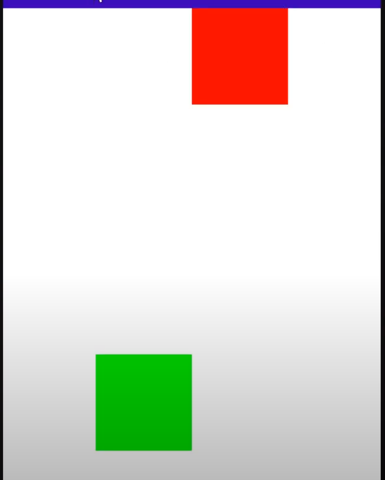
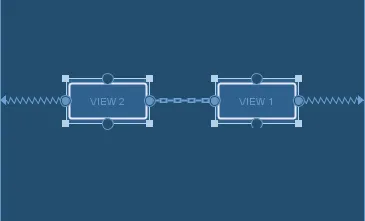

#### 
#### Composable (UI part)
turn UI to components (reusable)

#### Row Column
put text in correct position
```
Column {
    Text(text = "Hello")
    Text(text = "Goodbye")
}
```
if ROW its order horizontally, so X-axis is the Main-axis
Y-axis = Cross-axis (verticalAlignment)
X-axis = Main-axis (horizontalArrangement)

if Column , Y-axis (verticalArrangement), X-axis (horizontalAlignment)
Y-axis = Main-axis
X-axis = Cross-axis

SpaceBetween (separate them, dont have starting and ending space)
SpaceEvenly (separate them, have start and end space)
SpaceAround (similar SpaceEvenly, start and end space slightly smaller)


#### Modifier
the size distribute for this Column
fillMaxSize(0.5f) // 50% height, 50% width of total screen
OR
width(200.dp)
```
        setContent {
            Column(
                modifier = Modifier
                    .fillMaxSize()
                    .background(Color.Green),
                horizontalAlignment = Alignment.CenterHorizontally,
                verticalArrangement = Arrangement.Bottom
            ) {
                Text(text = "Hello")
                Spacer(modifier = Modifier.height(50.dp))
                Text(text = "Goodbye")
            }

        }
```
requiredWidth(it will exceed monitor screen with exactly width) vs width( it will set max width can hit)

Text(text = "Hello", modifier = Modifier.offset(50.dp, 30.dp)) // offset our text like margin but wont push away other elements
offset always start at top-left  move 50.dp from left-right, 30.dp top-bottom

Modifier.clickable{}
#### Spacer
Spacer(modifier = Modifier.height(50.dp)) // insert empty space above the Goodbye text

#### Box
col and row container that can put composable into it
Box can align with other box or overlap

#### sp(font size) dp(layout size)
sp because it scale upon user font
dp won't scale

#### Card + Box
Card contain 1 child Box
that child Box contain Image and 2 Box
which mean the Image and that 2 Box is overlapped but adjusted X,Y according to the maximum of parent Box size which is
200.dp
```
@Composable
fun ImageCard(
    painter: Painter,
    contentDescription: String,
    title: String,
    modifier: Modifier = Modifier
) {
    Card(
        modifier = modifier.fillMaxWidth(),
        shape = RoundedCornerShape(15.dp),
        elevation = CardDefaults.cardElevation(defaultElevation = 5.dp)
    ) {
        Box(modifier =Modifier.height(200.dp) ) {
            Image(
                painter = painter,
                contentDescription = contentDescription,
                contentScale = ContentScale.Crop
            )
            Box(
                modifier = Modifier
                    .fillMaxSize()
                    .background(
                        brush = Brush.verticalGradient(
                            colors = listOf(
                                Color.Transparent,
                                Color.Black
                            ),
                            startY = 300f
                    )   )
            )
            Box(
                modifier = Modifier
                    .fillMaxSize()
                    .padding(12.dp),
                contentAlignment = Alignment.BottomStart
            ) {
                Text(title, style = TextStyle(color = Color.White, fontSize = 16.sp))
            }
        }
    }
}
```

#### Annotated String
apply different style to different parts of our string  
buildAnnotatedString(
    withStyle() {
        
    }
)
```
Box(modifier = Modifier
                .fillMaxSize()
                .background(Color(0xFF101010))) {
                Text(
                    text = buildAnnotatedString {
                        withStyle(
                            style = SpanStyle(
                                color = Color.Green
                            )
                        ) {
                            append("J")
                        }
                        append("etpack ")
                        withStyle(
                            style = SpanStyle(
                                color = Color.Green
                            )
                        ) {
                            append("C")
                        }
                        append("ompose")
                    },
                    color = Color.White,
                    fontSize = 30.sp,
                    fontFamily = fontFamily,
                    fontWeight = FontWeight.Bold,
                    fontStyle = FontStyle.Italic,
                    textAlign = TextAlign.Center,
                    textDecoration = TextDecoration.Underline
                )
            }
```

#### State
describe how our given UI looks at the moment
how UI looks at specfic moment -> UI State
Counter variable of state of button
re-render -> recomposing (in jetpack compose)

If recompose, the function will execute again, thats why we need "remember" to store the current mutableStateOf()
```
    val color = remember {
        mutableStateOf(Color.Yellow)
    }
```
#### Row, Column
weight attribute, the importance of that column, so higher => more space for that element


#### Naming Convention
general the function is first letter is small
but if it is a @Composable fun , first letter is Capital

#### SnackBar
use for temporary display eg (Notification)
#### Scaffold
for toolbar , navigation
Scaffold is a composable in Jetpack Compose that provides a foundation for building an app. 
It takes a set of composables and arranges them in a consistent manner to create a consistent look and feel across all screens in your app.

#### TextField (need state that track the input text)
from material design, basic input field
BasicField, free to make your own design

#### rememberScrollState
```
            val scrollState = rememberScrollState()
            Column(
                modifier = Modifier.verticalScroll(scrollState)
            ) {
```

####  LazyColumn
LazyColumn already have scroll state

only load when we scroll
two way to achieve it (itemsIndexed, items)
itemsIndexed is simply a for-each, items is automatically generate all with defined size(500)
```
                itemsIndexed(
                    listOf("This","Is","Jetpack","Compose")
                ) {
                    index: Int, item: String ->
                    Text(
                        text = "$item $index",
                        fontSize = 24.sp,
                        fontWeight = FontWeight.Bold,
                        textAlign = TextAlign.Center,
                        modifier = Modifier
                            .fillMaxWidth()
                            .padding(vertical = 24.dp)
                    )
                }
                items(500) {
                    Text(
                        text = "Item $it",
                        fontSize = 24.sp,
                        fontWeight = FontWeight.Bold,
                        textAlign = TextAlign.Center,
                        modifier = Modifier
                            .fillMaxWidth()
                            .padding(vertical = 24.dp)
                    )
                }
```

#### ConstraintSet + ConstraintLayout
start(left), end(right), top(top) ,bottom(bottom)
    implementation(libs.androidx.constraintlayout.compose)
    implementation(libs.androidx.constraintlayout)
create reference for each composable we want to constraint
define rule (ConstraintSet)
make layout (ConstraintLayout)

```
            val constraints = ConstraintSet {
                val greenBox = createRefFor("greenbox")
                val redBox = createRefFor("redbox")

                constrain(greenBox) {
                    top.linkTo(parent.top) // top constraint of green box LINK TO parent TOP
                    start.linkTo(parent.start)
                    width = Dimension.value(100.dp)
                    height = Dimension.value(100.dp)
                }
                constrain(redBox) {
                    top.linkTo(parent.top)
                    start.linkTo(greenBox.end)
                    end.linkTo(parent.end)
                    width = Dimension.value(100.dp)
                    height = Dimension.value(100.dp)
                }
            }
            ConstraintLayout(constraints, modifier = Modifier.fillMaxSize()) {
                Box(modifier = Modifier
                    .background(Color.Green)
                    .layoutId("greenbox"))
                Box(modifier = Modifier
                    .background(Color.Red)
                    .layoutId("redbox"))

            }
```

It will place the redBox between start and parent end so its a middle, there will be empty white, so fill it
use "width = Dimension.fillToConstraints" 
``` 
start.linkTo(greenBox.end)
end.linkTo(parent.end)
width = Dimension.value(100.dp)
height = Dimension.value(100.dp)

```
make a horizontal chain, so all layout reference(greenBox,redBox) will have same group of rule set
createHorizontalChain(greenBox,redBox, chainStyle = ChainStyle.Packed)

guideline (transparent layout for ContraintLayout)   , which this guideline take (50% fraction of the screen)
val guideline = createGuidelineFromTop(0.5f)
when link to guideline, there will be a 50% transparent barrier and greenBox will start after the 50% of the screen 
```
constrain(greenBox) {
    top.linkTo(guideline) //
    start.linkTo(parent.start)
    width = Dimension.value(100.dp)
    height = Dimension.value(100.dp)
}
```


if simple Layout (row,col) , in xml/complex layout (use constraintlayout, significant performance issue)

A chain is a group of views that are linked to each other with bi-directional position constraints. For example, 
figure shows two views that both have a constraint to each other, thus creating a horizontal chain


#### Effect Handlers
Side Effect (escape the scope of composable function)
"i" is one of the side effect, we dont know when the program recompose after button clicked, so its not inside composable
use "effect handlers" instead
```
private var i = 0
...
        setContent {
            var text by remember {
                mutableStateOf("")
            }

            Button(onClick = {
                text += "#"
            }) {
                i++
                Text(text = text)
            }
        }
```
##### LaunchedEffect
for CoroutineScope, we can do suspension 

By default the LaunchedEffect will execute
When "text" change, the LaunchedEffect will cancel the execution and Relaunch it with new Value
```
LaunchedEffect(key1 = text) {
    delay(1000L)
}
```
LaunchedEffect also good on animation 
eg you are left click and right click picture, so the right click animation cancel and immediately execute left click
when you click right and click left so fast

##### rememberCoroutineScope (only use on callbacks eg onClick, onEventListener)
why only on callbacks? because you can track it (WONT BECOME Side Effect), like you click one then it can change one, which is controllable 
val scope = rememberCoroutineScope()
```
Button(onClick{
    scope.launch {
        delay(1000L)
        println("Hello World")
    }
}) {

}
```
##### rememberUpdatesState
for splash screen, we use onTimeOut() to finish the splash screen
However, onTimeout() inside LaunchedEffect may not linked to the updated onTimeout: () -> Unit function
eg you set onTimeout with 3 second, then somehow you set it as 5 second, the onTimeout() inside LaunchedEffect will have no idea about the 5 second update, so
just 3 second later, you out the splash

Solution: val updatedOnTimeout by rememberUpdatesState(newValue = onTimeout)
so the updatedOnTimeout will be updated when onTimeout changing 
```
fun demo(
onTImeOut: () -> Unit
) {
     val updatedOnTimeout by rememberUpdatesState(newValue = onTimeout)
     LaunchedEffect(key = true) {
        delay(3000L)
        updatedOnTimeout()
     }
}
```

##### DisposableEffect


#### LifeCycleEventObserver
to observe the current state the application is in (eg onPause, onStart, onStop)